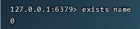
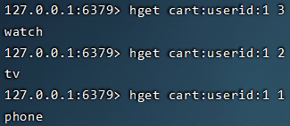
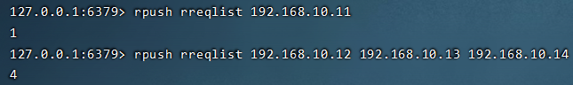
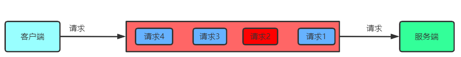
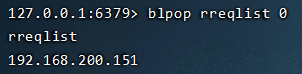
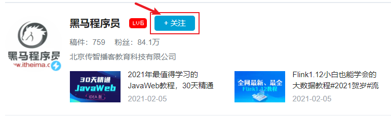
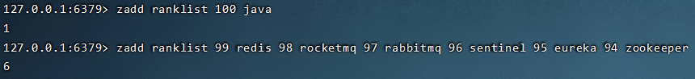
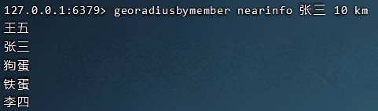

# Redis-day01

# 1 Redis概述

## 1.1 Redis介绍


Redis是一款通过C语言实现、基于内存、通过键值对完成数据操作的一款**NoSQL**数据库，也可以称为**非关系型数据库**。

其具备如下几个特点：

**性能极高：**读的速度可达到11W次/s，写的速度可达到8W次/s。

**丰富的数据类型：**String、Hash、List、Set、SortedSet等。

**原子性：**Redis内部使用单线程，可以让所有操作都是原子性的，同时还支持对几个操作全并后的原子性执行。

**持久化：**Redis提供数据持久化机制，尽可能保证数据不丢失。

那现在我们又接触到了两个新的名词，**NoSQL**与**非关系型数据库**。

## 1.2 NoSQL介绍

​	NoSQL指的就是**非关系型数据库**。那现在有的同学可能就想了，什么又叫非关系型数据库呢？  大家都知道我们之前学习的MySQL属于关系型数据库。 对于关系型数据库它存在如下的一些问题：

- **并发量巨大时，硬盘IO会成为性能瓶颈。**
- **表中存在海量数据时，查询效率低下。**
- **数据模型固定，当要对表结构修改时，成本往往是很巨大的。**
- **表结构关系复杂，随着数据量的增加，很难通过添加服务器的方式进行横向扩展，往往需要停机维护和数据迁移。**
- **经常需要进行多表关系查询以及复杂SQL执行，性能较差。**

对于关系型数据库存在的问题，现在则可以通过NoSQL进行解决，其具有如下特点：

- **高并发读写。**
- **海量数据的高效率存储和访问。**
- **高扩展性和高可用性。**
- **灵活的数据模型**

NoSQL数据库一般可以划分为四大类：

- **键值存储**
- **列存储**
- **文档数据库**
- **图形数据库**

| 分类       | 相关产品         | 典型应用                                                     |
| ---------- | ---------------- | ------------------------------------------------------------ |
| 键值存储   | Redis、Memcached | 主要用于处理数据的高效访问以及热点数据存储。                 |
| 列存储     | HBase、Cassandra | 适用于数据量较大且不需要复杂查询条件的应用。如社交消息、游戏日志等。 |
| 文档数据库 | MongoDB、CouchDB | 适用于存储与查询存在复杂关系的数据，如评论、用户信息等。     |
| 图形数据库 | Neo4J、InfoGrid  | 社交系统、推荐系统等，主要用于构建关系图谱。                 |

**场景案例分析**

抖音场景

**抖音热榜：Redis**


**弹幕、聊天信息：HBase**


**视频评论：MongodbDB**


**关注、粉丝：Neo4J**


## 1.3 安装

**1）下载redis镜像**

```yacas
docker pull redis:6.0.11
```

**2）创建目录**

```yacas
mkdir /mydata/redis/data
```

**3）上传redis.conf到/mydata/redis下**

**4）修改redis.conf文件权限**

```yacas
chmod 777 /mydata/redis/redis.conf
```

**4）创建Redis容器**

```yacas
docker run \
--name redis-master \
-p 6379:6379 \
-v /mydata/redis/data:/data \
-v /mydata/redis/redis.conf:/etc/redis/redis.conf \
--privileged=true \
-d redis::6.0.11 redis-server /etc/redis/redis.conf
```

**5）查看redis日志**

```yacas
docker logs -f myredis
```


**6）通过redis客户端工具连接测试**


# 2 Redis性能测试

## 2.1 压测工具使用

​	之前一直都在说Redis性能有多么多么的优秀，但是口说无凭，现在我们就来对redis进行一下性能测试。

​	Redis官方提供了一个压测工具redis-benchmark。

基本命令如下:

```yacas
redis-benchmark [option] [option value]
```

| 选项 | 描述           | 默认值    |
| ---- | -------------- | --------- |
| -h   | 指定服务IP     | 127.0.0.1 |
| -p   | 指定服务端口   | 6379      |
| -c   | 指定并发连接数 | 50        |
| -n   | 指定请求数     | 10000     |

操作使用：

```yacas
#测试1000个客户端发送10W个请求
docker exec -it myredis redis-benchmark -c 1000 -n 100000
```


​	根据现在的压测结果显示，大家可以看到，通过Redis操作数据的性能是非常强悍的。

## 2.2 Redis使用单线程为什么这么快

​	redis在通过指令操作数据时使用的是单线程，虽然说最新版redis已经支持了多线程，但是其只是通过多线程优化了网络IO操作，执行命令仍然是单线程的，通过指令的单线程操作从而避免了冲突问题的出现。

​	之前大家对于线程这里可能会存在一个很严重的误区：**系统中开启越多的线程，系统效率就会越高。**

​	这个想法准确来说是错误的。多线程在操作时，会产生线程的上下文切换，这是一个非常耗时的操作。而redis采用单线程对内存进行直接操作，避免出现上下文切换，这种操作的效率是非常高的。

# 3 Redis基本使用

## 3.1 Redis数据库

### 3.1.1 介绍

redis默认存在16个数据库，默认使用0号数据库。每个数据库中不会存在相同的key，但是不同的数据库中可以存在相同的key。


如果想要配置数据库数量，则可以通过**修改redis.conf中的databases属性**


### 3.1.2 指令

#### 3.1.2.1 连接redis客户端

对于Redis客户端的连接可以通过两种方式：Docker、图形化工具

```yacas
#docker连接redis-cli
docker exec -it myredis redis-cli
```


#### 3.1.2.1 切换数据库

语法格式：

```yacas
select 数据库索引
```

使用

```yacas
#切换到3号数据库
select 3

#存储数据
set name zhangsan

#获取数据
get name

#切换到5号数据库
select 5

#存储数据
set name zhangsan

#获取数据
get name
```


**当存储中文时，会出现显示问题**


对于该问题的解决，可以通过连接客户端时添加参数`--raw`解决

```yacas
docker exec -it myredis redis-cli --raw
```


#### 3.1.2.2 清空数据库

语法格式：

```yacas
flushdb
```

## 3.2 常见指令

### 3.2.1 查看当前数据库下所有的key

```yacas
#语法：keys *
#介绍：获取所有的key
```

### 3.2.2 删除指定key

```yacas
#语法：del key
#介绍：删除指定key
```

```yacas
del name
```


### 3.2.3 判断key是否存在

```yacas
#语法：exists key
#介绍：1代表存在，0代表不存在
```

```yacas
exists name
```



### 3.2.4 设置数据有效期

```yacas
#语法：expire key
#介绍：设置key的有效期，以秒为单位
```

```yacas
#数据准备
set name zhangsan

#对name设置过期时间为5秒
expire name 5
```


### 3.2.5 查看数据有效期

```yacas
#语法：ttl key
#介绍：查看key的有效期
```

```yacas
#数据准备
set name zhangsan

#对name设置过期时间为10秒
expire name 10

#查看有效期
ttl name
```


# 4 Redis数据类型

## 4.1 五种基本数据类型

### 4.1.1 String

​	String是一种使用非常广泛的数据类型，它能够表达3种值的类型：**字符串**、**整数**、**浮点数**。很多程序员对于redis的使用只是会用String进行数据保存和获取。

#### 4.1.1.1 数据保存

```yacas
#语法：set key value
#介绍：保存键值对
```

使用：**根据id保存商品名称**

```yacas
#set 商品id 商品名称
set 128 平板电脑
```


使用：**根据id保存商品对象**

```yacas
#set 商品id 商品对象（包含商品名称、商品价格）
set 256 "{'name':'鼠标','price':99}"
```


#### 4.1.1.2 数据获取

命令格式：

```yacas
get key
```

使用：**获取商品id获取商品名称**

```yacas
get 128
```


使用：**根据商品id获取商品对象**

```yacas
get 256
```


#### 4.1.1.3 数据删除

命令格式：

```yacas
del key
```

使用

```yacas
#根据key删除数据
del 128
```


#### 4.1.1.4 值自增与自减

场景分析：

​	以电商为例，每个商品都会存在销量、购买人数等信息。 对于这些信息如果直接基于Mysql来存储的话，在并发读写效率上较差，现在则可以将这部分数据在redis中进行操作。


**1）自增**

```yacas
#设置初始销量
set iphone 0

#根据商品名称对销量自增+1
#语法：incr key
incr iphone

#确定自增成功
get iphone
```


这种场景只会自增一个，但是有时可能一次自增多个，应该怎么办呢？

```yacas
#设置一次自增10个
#语法：incrby key 步长值（数量）
incrby iphone 10
```


**2）自减**

那现在有增加就会有减少，比方说用户退货了，那这销量是不是就要减少呀

```yacas
#对iphone的销量扣减
#语法：decr key
decr iphone
```


根据刚才的演示可以看到，其只会扣减一个，但是如果用户退了多个呢？该怎么办呢？

```yacas
#对iphone的销量扣减6个
#语法：decrby key 步长值（数量）
decrby iphone 6
```


#### 4.1.1.5 设置有效期

场景分析：

​	在一些活动场景下，如秒杀、促销、店庆等等。商品都只是在一段时间内有效，那么这个功能应该如何实现呢？


```yacas
#新增商品并设置有效期
#语法：setex key seconds(有效期) value
setex 666 5 鼠标
```


#### 4.1.1.8 特殊使用

场景分析：

​	以活动场景，不同的活动下，会存在不同的商品。 根据我们之前的学习，现在可以达到这个需求么？ 明显达不到，截止到现在，都是一个key对应一个value，那这时该怎么办呢？ 我们这时就可以对key使用一种特殊的写法。

​	对于key的编写可以通过`:`冒号进行分层， 什么意思呢？ 我们一起来看下效果

```yacas
#设置不同活动下的不同商品
set hd:1:11 tv1
set hd:1:12 tv2
set hd:1:13 tv3

set hd:2:21 watch1
set hd:2:22 watch2
set hd:2:23 watch3
```


通过图形化工具，大家很明显的看到目录层级格式。在key中通过对冒号的使用，可以进行结构分层， 从而更加利于数据归类。

### 4.1.2 Hash

​	该类型也是一种经常会使用的类型，主要用于数据需要归类的场景下。 基本数据格式： **key field value**。大家可以将其理解为：**key map**结构， 这样的话，相信大家更容易理解。 但是大家要注意，现在想要获取到value值该怎么办？  通过key能直接获取到么？ 不能，我们需要key和field才能最终获取到value。


​	现在以购物车场景为例，完成对Hash类型常用命令的学习。


#### 4.1.2.1 添加数据

场景分析：

​	向购物车添加商品


```yacas
#语法：hset key field value
#考虑每个用户会有自己的购物车，所以key使用冒号形式，拼接userid
#hset cart:userid（key） 商品id（field） 商品名称（value）
hset cart:userid:1 1 phone
hset cart:userid:1 2 watch
hset cart:userid:1 3 computer
```

#### 4.1.2.2 获取数据

场景分析：

​	购物车中有了数据后，从购物车中根据商品id获取商品名称

```yacas
#语法：hget key field
hget cart:userid:1 3
```



#### 4.1.2.3 获取所有数据

场景分析：

​	刚才只是获取某一个商品，但是正常情况下，当用户点开购物车后，应该获取到其购物车下的所有商品，这又该如何实现呢？


```yacas
#语法：hgetall key
hgetall cart:userid:1
```


#### 4.1.2.4 获取数据数量

场景分析：

​	结合淘宝购物车页面来说，需要展示购物车中的商品数量，那么这个数据我们又该如何获取呢？


```yacas
#语法：hlen key
hlen cart:userid:1
```


#### 4.1.2.5 删除数据

场景分析：

​	用户可能会将自己购物车中的某个商品删除掉，那这个功能该如何实现呢？


```yacas
#语法：hdel key field
hdel cart:userid:1 1

#查询数据量
hlen cart:userid:1
```


#### 4.1.2.6 判断数据是否存在

场景分析：

​	当用户向购物车中添加商品时，需要判断这个商品在购物车是否存在，如果存在则更新数量，不存在则添加

```yacas
#语法： hexists key field
hexists cart:userid:1 3
```


#### 4.1.2.7 获取所有的field

场景分析：

​	用户在对购物车中商品进行结算时，可以会选择全部进行结算。从开发角度来说，我们就只需要获取到所有商品id发送到后台就可以了， 那么这个功能又该如何实现呢？


```yacas
#语法：hkeys key
hkeys cart:userid:1
```


​	既然能够获取到所有的field，那么能不能获取到所有的value呢？ 当然也是可以的。

```yacas
#语法：hvals key
hvals cart:userid:1
```


#### 4.1.2.8 保证数据唯一性

场景分析：

​	在购物车中，会存在店铺信息，如果店铺不存在则添加，如果店铺存在则不添加。保证店铺在购物车中的唯一性。


```yacas
#语法：hsetnx key field value
hsetnx cart:userid:1 shop itheima
```


#### 4.1.2.9 应用场景

​	hash结构可以存储 2^32 - 1 键值对（约40多亿）。主要适应于进行对象存储，而且通过它可以很容易的把关系型数据库的表结构存入到redis中。

​	现在有的通过可能会想了，通过String的json也可以存储对象，hash也可以存储对象，那么该选择哪种呢？ 根据开发经验来说，当对象的某个属性需要频繁修改时，如商品的价格、销量、关注数、评价数等，建议通过hash进行存储，它可以针对某个属性单独修改。而如果这些数据通过String的json存储的话，修改起来则很麻烦。 

### 4.1.3 List

​	List是一种基于链表实现的字符串列表，按照插入顺序排序，并且允许存在重复元素。每个列表最多可以存在2^32-1（40多亿）个元素。 其经常用于存储列表输入、或作为队列使用。如秒杀场景下，服务端可能无法同时处理过多请求，则可以通过redis将客户端请求暂存在redis队列中。


#### 4.1.3.1 插入数据

**1）左侧插入**


```yacas
#语法 lpush key value1 [value2]
lpush lreqlist 192.168.200.151
lpush lreqlist 192.168.200.152 192.168.200.153 192.168.200.154
```


```yacas
#获取队列全部数据
#语法：lrange key start end
lrange lreqlist 0 -1
```


大家从此处可以看到，遍历时是从头部向尾部遍历，所以先进去后出来，达到栈的效果。

**2）右侧插入**


```yacas
#语法 rpush key value1 [value2]
rpush rreqlist 192.168.10.11
rpush rreqlist 192.168.10.12 192.168.10.13 192.168.10.14
```



```yacas
#获取队列全部数据
lrange rreqlist 0 -1
```


大家从此处可以看到，因为是从右侧向队列插入，同时从头部遍历，所以先进入的先出来，达到队列的效果。

#### 4.1.3.2 获取列表长度

场景分析：

​	假定当队列中存在超过100个元素，则不再向队列中插入数据。因此在向队列插入请求时，需要获取整个队列长度，并判断是否超过100，没有超过则添加请求。

```yacas
#语法：llen key
llen lreqlist
```


#### 4.1.3.3 获取并移除第一个元素

场景分析：

​	现在队列中已经存在了若干的请求，需要将其按顺序从队列中获取出来。

```yacas
#语法
lpop key 获取并移出第一个元素
rpop key 获取并移出最后一个元素
```

**1）左进左出（栈）先进后出**


```yacas
lpop lreqlist
```


**2）右进右出（栈）先进后出**


```yacas
rpop rreqlist
```


**3）左进右出（队列） 先进先出**


```yacas
rpop lreqlist
```


**4）右进左出（队列） 先进先出**


```yacas
lpop rreqlist
```


`结论：同方向为栈，不同方向为队列`

#### 4.1.3.4 根据索引获取元素

场景分析：

​	正常排队处理属于公平方式，但是基于非公平的思想，可以提前获取列表中某个请求进行处理。假设现在后端就要指定获取请求2优先处理，这时应该怎么办呢？ list本身是一个链表，那么元素势必会存在索引，因此可以通过索引获取特定元素。从0开始计算



​	

```yacas
#语法：lindex key index
lindex lreqlist 2
```


#### 4.1.3.5 移除列表元素

场景分析：

​	按照上述需求， 当后端获取到了该请求后，则应该将该请求从队列中删除。现在该怎么做呢。


```yacas
#语法：lrem key count value
#当count为正数，是从前往后删。 当count为负数，是从后往前删
#当count为0，则删除所有指定元素
#测试数据
lpush lreqlist 192.168.200.151 192.168.200.151 192.168.200.151 192.168.200.152 192.168.200.153 192.168.200.154 

lrem lreqlist 0 192.168.200.151
```


#### 4.1.3.6 阻塞获取

场景分析：

​	假设redis列表中现在没有元素，但是后端服务要来获取请求，发现没有就过一会再来看有没有，然后继续没有。 大家现在想一下，这样是不是会造成服务端需要经常与redis建立连接通信，比较耗费资源。 而且实时性也不高。 那现在对于这个问题如何解决呢？ 

​	我们可以通过列表中提供的**阻塞获取**的方式来进行解决。那什么叫阻塞获取呢？ 当从列表中获取元素时，如果没有则等待，直到有了为止。

**1）从列表中获取第一个请求，如果没有则阻塞等待**


```yacas
#语法：blpop key1 [key2...] timeout
```

使用：

```yacas
#客户端1
rpush rreqlist 192.168.200.151
```


```yacas
#客户端2
blpop rreqlist 0
```



```yacas
#客户端2
blpop rreqlist 0
```


```yacas
#客户端1
rpush rreqlist 192.168.200.152
```

当客户端1又插入一条数据后，可以发现客户端2的阻塞消失，并获取到相关数据


**2）从列表中获取最后一个请求，如果没有则阻塞等待**

```yacas
#语法： brpop key1 [key2...] timeout
```

这里又大家自行练习，只是获取方向不同而已。

#### 4.1.3.7 向指定位置插入元素

场景分析：

​	大家也都知道，像淘宝，天猫，京东来说，会员都有等级。 那么假设他们在发起一场活动时，比方说：会员节。 后台可能设置会员等级越高的人，秒杀成功几率就越高。 那么我们就可以让会员等级高的人发出的请求，可以插队到会员等级低的人前面。 那么这又该如何实现呢？


```yacas
语法：LINSERT key BEFORE|AFTER pivot（插入点） value（插入值）  在列表的元素前或者后插入元素
```

使用

```yacas
rpush rreqlist 192.168.200.151 192.168.200.152 192.168.200.153
lrange rreqlist 0 -1
```


现在要把154的请求插入到151前面。

```yacas
linsert rreqlist before 192.168.200.151 192.168.200.154
```


### 4.1.4 Set

​	特点：**元素无序、元素唯一**。适用于存储不能重复且不需要顺序的数据。如**关注、粉丝、抽奖等场景**。


现在以关注场景为例，完成对Set类型常用命令的学习。

#### 4.1.4.1 添加数据

场景介绍：

​	用户登录后，可以添加自己关注的UP主。



```yacas
#语法：SADD key member [members...]
#介绍：添加元素 一个或多个
```

使用

```yacas
SADD concern:1 java
SADD concern:1 go python redis rocketmq

sadd concern:2 java redis hive hbase spark
```


#### 4.1.4.2 获取集合中元素数量

场景分析：

​	在页面上，我们可以看到每个人的关注数量有多少，那么这个数据应该如何获取呢？


```yacas
#语法：scard key
#介绍：根据key获取集合中元素数量
```

```yacas
scard concern:1
```


#### 4.1.4.3 获取集合中所有元素

场景分析：

​	知道了查看数量后，有时我们就会很好奇，他都关注了哪些其他人呢？   其实对于这个功能来说，无非就是获取集合中的所有元素。


```yacas
#语法：smembers key
#介绍：根据key获取某个集合下的元素列表
```

```yacas
smembers concern:1
```


#### 4.1.4.4 删除数据

场景分析：

​	对于用户的一些关注， 用户现在可能不想看他了，就会取消对它的关注。


```yacas
#语法：srem key member1 [member2...]
#介绍：根据key删除一个或多个元素
```

```yacas
srem concern:1 go
```


#### 4.1.4.5 求多集合交集

场景分析：

​	后台需要对用户的关注进行统计分析， 需要获取到多个用户相同的关注。


```yacas
smembers concern:1
smembers concern:2
```


```yacas
#语法：sinter key1 key2 key3...
#介绍：求多集合的交集
```

```yacas
sinter concern:1 concern:2
```


#### 4.1.4.6 求多集合差集

场景分析：

​	后台需要对用户的关注进行统计分析， 需要获取到多个用户不同的关注。


```yacas
smembers concern:1
smembers concern:2
```


```yacas
#语法：sdiff key1 key2 key3...
#介绍：获取第一个集合与其他集合之间的差异
```

```yacas
sdiff concern:1 concern:2  #获取concern:1中与concern:2差异化的数据
```


```yacas
sdiff concern:2 concern:1 #获取concern:2中与concern:1差异化的数据
```


#### 4.1.4.7 求多集合并集

场景分析：

​	后台需要对用户的关注进行统计分析， 需要获取到多个用户所有的关注。


```yacas
#语法：sunion key1 key2 key3...
#介绍：求多个集合的并集
```

```yacas
sunion concern:1 concern:2
```


### 4.1.5 Sortedset

​	Sortedset也被称为Zset。其不同于Set，它是一个有序集合，同时集合中元素是不重复的。它最经典的应用场景就是排行榜。


#### 4.1.5.1 添加数据

场景分析：

​	要做排行的话，一定需要先向集合中保存数据。

```yacas
#语法：ZADD key score1 member1 [score2 member2...]
#介绍：向集合添加一个或多个成员
```

```yacas
zadd ranklist 100 java
zadd ranklist 99 redis 98 rocketmq 97 rabbitmq 96 sentinel 95 eureka 94 zookeeper
```



#### 4.1.5.2 获取集合元素数量

场景分析：

​	对于排行榜来说，数据数量一般都是有限制的。因此，我们在添加元素时，需要先确定下当前集合中的元素数量。

```yacas
#语法：zcard key
#介绍：根据key获取集合中元素数量
```

```yacas
zcard ranklist
```


#### 4.1.5.3 按分数排序

场景分析：

​	排行榜的核心功能就是数据排序。在向sortedSet添加数据时，我们设置了score分数， 现在就该发挥它的作用了。

##### 4.1.5.3.1 升序排序

```yacas
#语法：ZRANGEBYSCORE key min max [WITHSCORES] [LIMIT]
#介绍：获得集合中指定区间成员，按分数升序排序
```

```yacas
#对所有元素按升序排序
zrangebyscore ranklist -inf +inf WITHSCORES
```


```yacas
#显示分数大于等于95的数据
zrangebyscores ranklist 95 +inf withscores
```


```yacas
显示分数大于95,小于等于98的数据
#如携带小括号则不包括等于，不携带则包括等号
zrangebyscore ranklist (95 98 withscores
```


##### 4.1.5.3.2 降序排序

​	有升序的则势必存在降序，那么降序又该如何实现呢？

```yacas
#语法：zrevrangebyscore key max min [WITHSCORES] [LIMIT]
#介绍：获得集合中指定区间成员，按分数递减排序
```

```yacas
zrevrangebyscore ranklist +inf -inf withscores
```


#### 4.1.5.4 为元素加分

场景分析：

​	排行榜是根据一些属性实时动态变化的，如点击量、播放量、收藏量等等。所以对于元素的分数也应该动态的进行增加。

```yacas
#语法：zincrby key increment member 
#介绍：为某个key中的某个元素加分（increment）
```

```yacas
zincrby ranklist 10 zookeeper
```


```yacas
zrevrangebyscore ranklist +inf -inf withscores
```


#### 4.1.5.5 删除元素

场景分析：

​	排行榜一般都是有长度限制的， 如果末位的元素被超越，则应该将其删除掉。


```yacas
#语法：zrem key mem1 mem2.... 
#介绍：删除集合中指定元素
```

```yacas
zrem ranklist eureka
```


## 4.2 三种高级数据类型

### 4.2.1 Geospatial

​	geo是Redis用来处理位置信息的。在Redis3.2中正式使用。主要用于计算距离、地理位置、 **搜索附近人**。


#### 4.2.2.1 添加地理坐标

场景分析：

​	要获取附近人的话，首先需要先对地理位置进行录入。

```yacas
#语法：geoadd key longitude(经度) latitude(纬度) member [longitude latitude member ...]
#介绍：添加地理坐标
```

访问：http://www.daquan.la/jingwei/   获取地点的经纬度

```yacas
geoadd nearinfo 116.401481 40.003264 张三 116.342264 39.951955 李四 116.404355 39.920089 王五
```


#### 4.2.2.2 获取成员经纬度

场景分析：

​	我们要进行附近人匹配的话，可以通过获取到各个成员的经纬度进行计算

```yacas
#语法：geopos key member1 member2... 
#介绍：获取指定成员经纬度
```

```yacas
geopos nearinfo 张三 李四
```


#### 4.2.2.3 计算成员间距离

场景分析：

​	一般在搜索附近人的时候，都会限制成员间的距离， 比方说只会显示三公里以内的附近人， 那么这个又该如何实现呢？

```yacas
#语法：geodist key member1 member2 [m|km|ft|mi]
#介绍：计算成员间距离
#m ：米，默认单位。
#km ：千米。
#mi ：英里。
#ft ：英尺。
```

```yacas
geodist nearinfo 张三 李四 km
```


#### 4.2.2.4 根据成员查找附近成员

场景分析：

​	通过手动挨个计算距离太麻烦了， 正常来说， 搜索附近人的话， 应该按照我自己的当前位置来搜索附件的人， 那么这个又该如何实现呢？

```yacas
#语法：georadiusbymember key member 距离值 m|km|ft|mi [WITHCOORD] [WITHDIST] [WITHHASH] [COUNT 数量] [ASC|DESC]
#介绍：根据成员查找附件的成员，查找某个人在一定距离内的附近人
```

```yacas
georadiusbymember nearinfo 张三 8 km
```


```yacas
georadiusbymember nearinfo 张三 10 km
```


在获取附近人的时候，有时可能会限制附近人的数量 以及 按距离进行排序

```yacas
#数据准备
geoadd nearinfo 116.496917 39.955495 狗蛋 116.460697 40.017412 铁蛋 116.326167 39.927172 丫蛋

georadiusbymember nearinfo 张三 10 km
```



```yacas
#需求：获取10公里内，距离张三最近的三个人,升序（从近到远）
georadiusbymemeber nearinfo 张三 10 km withdist count 4 asc
```


### 4.2.2 HyperLogLog

HyperLogLog是Redis 在 2.8.9 版本新增一种数据结构，主要用于做基数统计的算法。适用于统计网站访问量（PV）、UV（网站访客）相关数据。

#### 4.2.2.1 什么是基数

​	所谓的基数，即集合中不重复的元素个数。  假设现在存在一个集合：{1,2,3,4,5,5,4,3,2,1}。那么这个集合的基数就是：5。

#### 4.2.2.2 场景与功能实现分析

​	以UV（网站访客）为例，一个人可以访问某个网站多次，但是其根本上只能算作一个网站访客。 那么现在要来统计UV数量的话，我们想想应该如何实现呢？  给大家个提示： 去重。   那么其实这个功能可以通过set来实现。

**1）通过set实现统计UV数量**

​	当用户访问后，通过set集合保存用户id，然后对set中的元素进行数量统计，即可获取到网站访客数量。 功能实现上非常简单。 但是这并不是最优方案，因为通过set保存大量用户Id的话，会占用大量内存空间，而且集合中的userId本身也没有实际意义，只是用来统计而已。

**2）通过HyperLogLog实现统计UV数量**

​	在redis中，每个HyperLogLog只会占用 12 KB 内存并且空间是固定的，但是其能够存储计算接近 2^64 （18446744073709551616）个不同元素。 这就与set存储形成了鲜明的对比。  但是有得必有失，HyperLogLog在进行数据计算时，存在一定的误差率，官方说存在有0.81%的错误率。 但是对于这种统计PV、UV的场景来说， 这完全是可以接收的。

#### 4.2.2.3 操作指令

##### 4.2.2.3.1 添加数据

```yacas
#语法：pfadd key element [element ...]
#介绍：添加指定元素到 HyperLogLog
```

```yacas
pfadd uvinfo 1 2 3 4 5 6 7 8 9 10 10 8 6 5 3
```


##### 4.2.2.3.2 统计计算

```yacas
#语法：pfcount key [key ...]
#介绍：返回给定 HyperLogLog 的基数估算值
```

```yacas
pfcount uvinfo
```


### 4.2.3 BitMap

#### 4.2.3.1 场景分析

​	大家也都知道redis是基于内存来保存数据的，因此对于内存空间的使用率则是其非常关注的一点。 那么现在给大家一个需求，记录用户每日的签到信息。我们可以采用redis的哪种数据类型来存储呢？ 通过String、Hash、List、Set都是可以实现这个功能的。 比方说通过String可以这样设置`sign:1:20210225 1`代表签到。 


​	但是此时需要注意，一个数字或者一个字母占用一个字节。 虽然一个字节并不大，但是现在如果现在要记录很多用户的签到信息呢？ 积少成多呀。而且这些数据是每天都会增加的。

**计算：现在每天有一千万人签到， 每天就需要10000000个字节。 10000000/1024/1024=9.53mb。 一个月就需要285.9mb。一年就需要3478.45mb 约为3.4G。**

#### 4.2.3.2 概述

​	BitMap是基于位（bit）操作的，因此其只能存储0和1的数据，因此它可以极大的节省存储空间。但是其只适合存储简单结构数据，如状态性信息，比方用户是否签到、用户是否为活跃用户、用户是否在线等等。

**计算：现在每天有一千万人签到 ，每天需要1000000bit。10000000/8=1250000byte/1024/1024=1.19mb。一个月需要35.76mb。一年需要434.35mb。**

#### 4.2.3.2 操作指令

##### 4.2.3.2.1 保存数据

场景分析：

​	当用户点击签到时，需要保存哪个用户在哪一天的签到信息。


```yacas
#语法：setbit key offset value
#介绍：设置key在offset处的bit值(只能是0或1)
```

```yacas
#sign:日期  用户id  是否签到
setbit sign:20210225 1 1
setbit sign:20210225 2 0
```


##### 4.2.3.2.2 获取数据

场景分析：

​	在签到页面，需要展示用户在某一天是否已经签到


```yacas
#语法：getbit key offset 
#介绍：获得key在offset处的bit值
```

```yacas
getbit sign:userid:1 20200225

getbit sign:userid:2 20210225
```


##### 4.2.3.2.3 获取key的bit位为1的个数

场景分析：

​	假设现在需要统计某天已签到的用户数量、或者在线的用户数量等等。 应该如何获取到呢？ 

```yacas
#数据准备
setbit 20210225 1 1
setbit 20210225 2 1
setbit 20210225 3 1
setbit 20210225 4 1
setbit 20210225 5 1
setbit 20210225 6 0
setbit 20210225 7 0
```

```yacas
#语法：bitcount key
#介绍：获得key的bit位为1的个数
```

```yacas
bitcount 20210225
```


##### 4.2.3.2.4 操作bitmap AND 、 OR 、 NOT 、 XOR


# 7 SpringBoot整合Redis

## 7.1 基础整合

1）导入**/04_资料/基础工程**

2）修改redis_lesson的pom文件，添加redis依赖

```xml
<dependency>
    <groupId>org.springframework.boot</groupId>
    <artifactId>spring-boot-starter-data-redis</artifactId>
</dependency>
```

3）修改application.yml，配置redis连接信息

```yml
spring:
  redis:
    host: 192.168.200.151
    port: 6379
```

4）添加redis配置类

```java
//添加配置类 用来保证
@Configuration
public class RedisConfig {

    @Bean
    public RedisTemplate redisTemplate(RedisConnectionFactory redisConnectionFactory){
        RedisTemplate redisTemplate = new RedisTemplate();
        redisTemplate.setConnectionFactory(redisConnectionFactory);

        //解决Redis  key的序列化方式
        redisTemplate.setKeySerializer(new StringRedisSerializer());

        //解决Redis value的序列化方式
        Jackson2JsonRedisSerializer jackson2JsonRedisSerializer =new Jackson2JsonRedisSerializer(Object.class);
        ObjectMapper objectMapper = new ObjectMapper();
        objectMapper.activateDefaultTyping(LaissezFaireSubTypeValidator.instance,ObjectMapper.DefaultTyping.NON_FINAL, JsonTypeInfo.As.WRAPPER_ARRAY);
        jackson2JsonRedisSerializer.setObjectMapper(objectMapper);
        redisTemplate.setValueSerializer(jackson2JsonRedisSerializer);
        redisTemplate.setHashValueSerializer(jackson2JsonRedisSerializer);
        return redisTemplate;
    }
}
```

5）编写测试类

```java
@SpringBootTest
@RunWith(SpringRunner.class)
public class RedisTest {

    @Autowired
    private RedisTemplate redisTemplate;

    //String
    //添加数据
    @Test
    public void addInfo(){
        redisTemplate.opsForValue().set("name","zhangsan");
        //设置过期时间
        redisTemplate.opsForValue().set("age",18,5, TimeUnit.SECONDS);
    }

    //获取数据
    @Test
    public void getInfo(){
        redisTemplate.opsForValue().get("name");
    }

    //删除数据
    @Test
    public void setExpire(){
        redisTemplate.delete("name");
    }
}
```

## 7.2 业务实现

场景分析：

​	以商品详情页为例，假设现在客户端有大量请求在查询商品详情信息， 如果直接基于数据库查询的话，则很有可能因为数据库性能问题，造成系统响应速度过慢，甚至宕机。那么此时则可以基于Redis进行改造。 

改造思路如下图所示：


```java
@Service
public class GoodsServiceImpl implements GoodsService {

    @Autowired
    private GoodsMapper goodsMapper;

    @Autowired
    private RedisTemplate redisTemplate;

    @Override
    public GoodsEntity findGoodsInfoById(Long goodsId) {

        //先查询缓存
        GoodsEntity redisGoods = (GoodsEntity) redisTemplate.opsForValue().get("goods:" + goodsId);
        if (redisGoods!= null){
            return redisGoods;
        }

        GoodsEntity goodsEntity = goodsMapper.selectById(goodsId);
        //存入缓存
        redisTemplate.opsForValue().set("goods:"+goodsId,goodsEntity);

        return goodsEntity;
    }
}
```